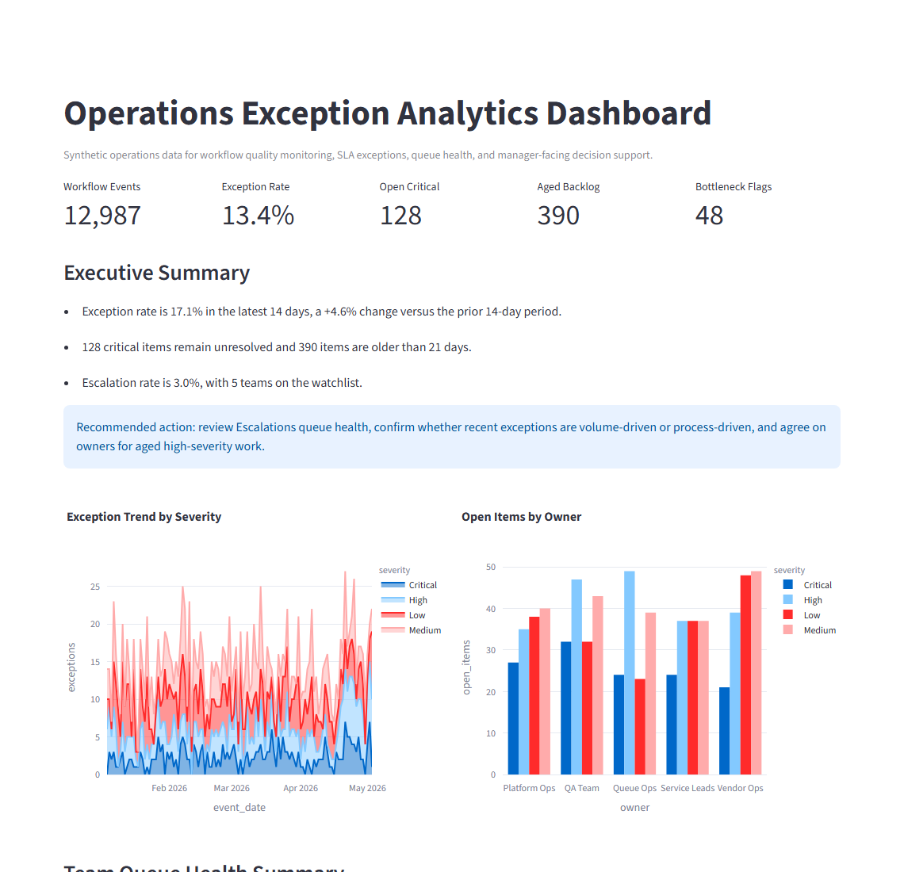

# Operations Exception Analytics Dashboard

A manager-facing Streamlit dashboard for monitoring workflow quality, queue health, SLA exceptions, backlog aging, escalation trends, and bottleneck signals using synthetic operations data.

## Screenshot



## Problem

Service teams often need to understand where work is slowing down before missed SLAs and unresolved exceptions become visible to customers. Raw queue exports can show activity, but they rarely explain which teams need attention or what action should happen next.

## Solution

The app generates synthetic workflow events across teams, owners, queue stages, severity levels, SLA outcomes, and aging. It summarizes KPI movement, flags unusual exception patterns, highlights aging backlog, and produces a short executive summary with recommended manager actions.

## Core Features

- Synthetic dataset generator for workflow events, SLA exceptions, owners, teams, queue stages, and aging
- KPI dashboard for exception rate, open critical issues, backlog aging, escalation rates, and bottleneck flags
- Threshold and isolation-forest anomaly detection for unusual queue activity
- Severity trends and team views for prioritization
- Executive summary that explains what changed, why it matters, and recommended actions

## Business Value

- Helps managers identify workflow quality issues before service levels deteriorate
- Makes exception ownership and queue bottlenecks visible across teams
- Connects analytics output to practical prioritization and follow-up actions
- Demonstrates analytics product thinking, operational leadership, and practical ML familiarity

## Tech Stack

Python, Streamlit, pandas, NumPy, scikit-learn, Plotly

## How To Run

```bash
pip install -r requirements.txt
streamlit run app.py
```

## Project Structure

```text
.
|-- app.py
|-- requirements.txt
|-- data/
|   `-- README.md
`-- screenshots/
    `-- README.md
```

## Notes

All data is synthetic and fictional. This project is a general portfolio demo and is not based on any real company system, confidential workflow, or non-public process.
